# 🗄️ x8

**An S3-compatible remote compilation cache proxy for Xcode.**

[](https://github.com/Ryu0118/x8/actions/workflows/test.yml)
[](LICENSE)
[](https://swift.org)
[](https://developer.apple.com/macos/)

**[Full API documentation →](https://ryu0118.github.io/x8/documentation/x8kit/)**

Xcode already caches compiled Swift/Clang modules, but that cache lives on
each machine: a module built on one Mac is built again on every other Mac and
CI runner. x8 lets a team share one cache instead. It speaks Xcode's cache
protocol over a local Unix domain socket and stores the cached objects in AWS
S3, Cloudflare R2, or any other S3-compatible bucket, so whatever one machine
compiles, every other machine can download instead of rebuilding.

## Table of Contents

- [How it works](#how-it-works)
- [Installation](#installation)
- [Quick Start](#quick-start)
- [Enabling the remote cache](#enabling-the-remote-cache)
  - [`xcodebuild` / CI](#1-xcodebuild--ci--x8-xcodebuild)
  - [Xcode.app's GUI](#2-xcodeapps-gui--ten-build-settings)
- [Configuration](#configuration)
- [Commands](#commands)
- [Using another storage implementation](#using-another-storage-implementation)
- [Documentation](#documentation)
- [License](#license)

## How it works

<picture>
  <source media="(prefers-color-scheme: dark)" srcset="Diagrams/how-it-works~dark.svg">
  
</picture>

A handful of build settings point Xcode's Compilation Cache plugin at a local
socket. x8 listens on that socket, speaks the gRPC protocol the plugin
expects, and translates each cache lookup or upload into a read or write of
one object in your bucket (an S3 `GetObject` or `PutObject` request, which is
why any S3-compatible provider works).

## Installation

x8 needs Xcode 27 or later (which itself requires macOS 26) and an
S3-compatible bucket — AWS S3, Cloudflare R2, MinIO, or similar. That is all
you need to get started. Xcode 26 is unsupported because it crashes on cached,
prefix-mapped builds; the
[Toolchain support](Sources/X8Kit/X8Kit.docc/PrefixMapping.md#toolchain-support)
note has the details if you are curious, but you don't need to read it now.

### Nest ([mtj0928/nest](https://github.com/mtj0928/nest))

```sh
nest install Ryu0118/x8
```

### Mise ([jdx/mise](https://github.com/jdx/mise))

```sh
mise use -g github:Ryu0118/x8
```

### Other methods

Each [GitHub Release](https://github.com/Ryu0118/x8/releases) publishes a
darwin universal binary archive and a SwiftPM `.artifactbundle`. To build
from source instead:

```sh
git clone https://github.com/Ryu0118/x8.git
cd x8
swift build -c release --traits S3
cp .build/release/x8 /usr/local/bin/x8
```

## Quick Start

1. Create `.x8.yml` at your project root:

   ```yaml
   version: 1
   bucket: my-team-cache
   # endpoint is optional for AWS S3 — omit it entirely and x8 uses AWS's
   # default endpoint. Set it only for an S3-compatible provider. For R2,
   # replace abc123 with your Cloudflare account ID (shown in the R2
   # dashboard next to the bucket's S3 API URL):
   endpoint: https://abc123.r2.cloudflarestorage.com
   ```

2. Provide credentials. Every field in `.x8.yml` supports POSIX-style
   `$VAR`/`${VAR}` expansion against the process environment, so static
   credentials can be committed by reference:

   ```yaml
   accessKeyID: ${AWS_ACCESS_KEY_ID}
   secretAccessKey: ${AWS_SECRET_ACCESS_KEY}
   ```

   Without static credentials, x8 uses the standard AWS credential provider
   chain (environment, shared config file, SSO, `AssumeRole`,
   container/instance metadata) — nothing to configure. Never commit a
   *literal* secret value to `.x8.yml`; `$VAR` references are fine.

3. Confirm everything is wired up:

   ```sh
   x8 doctor
   ```

4. Build through the proxy:

   ```sh
   x8 xcodebuild -workspace MyApp.xcworkspace -scheme MyApp build
   ```

   If the build succeeds, x8 is proxying the cache: this first build
   uploads each compiled module to your bucket, and a later build of the same
   unchanged modules on another machine (or on this one after clearing
   DerivedData) downloads them instead of running the compiler. That is all a
   command-line or CI build needs. Building from Xcode.app instead uses a
   long-running `x8 serve` plus a few build settings — see
   [Xcode.app's GUI](#2-xcodeapps-gui--ten-build-settings) below.

## Enabling the remote cache

There are two ways to point Xcode at x8's socket, depending on how you build.
For command-line builds, `x8 xcodebuild` supplies the cache connection and
prefix-mapping settings without changing build paths. For Xcode.app builds,
configure the printed cache settings in the project or an `.xcconfig`.

### 1. `xcodebuild` / CI — `x8 xcodebuild`

Wraps a normal `xcodebuild` invocation with an embedded, invocation-scoped
proxy. No `.xcconfig` or `project.pbxproj` edits required:

```sh
x8 xcodebuild -workspace MyApp.xcworkspace -scheme MyApp build
```

Pass `xcodebuild`, or an absolute path ending in `xcodebuild` (for a specific
Xcode.app), as the first argument; everything after it is forwarded to that
executable unchanged. x8 preserves the caller's build arguments and chosen
directories.

x8 also makes the build portable across machines through *prefix mapping*:
compiled output normally embeds absolute paths such as
`/Users/you/src/MyApp`, which differ on every machine and would prevent a
module built on your Mac from being a cache hit on CI. Prefix mapping replaces
those paths with stable placeholders before they reach the cache. Concretely,
x8 injects the cache connection and prefix-mapping settings as
`SETTING=VALUE` overrides, mapping the working directory to the shared
`/^workspace` logical prefix. It does not inject or replace
`-derivedDataPath`, `-clonedSourcePackagesDirPath`, or build-output
settings. Pass `--no-prefix-mapping` (before the child `xcodebuild`
argument) if your project sets these portability settings itself. See
[Prefix mapping](Sources/X8Kit/X8Kit.docc/PrefixMapping.md) for what each
setting does and which build shapes it cannot make portable.

### 2. Xcode.app's GUI — ten build settings

Xcode's GUI builds can't be wrapped, so they need the settings Xcode's
Compilation Cache plugin looks for, added directly to your target (or an
`.xcconfig`) as **user-defined build settings** (they aren't exposed in
Xcode's Build Settings UI, so add them by name). Together they tell Xcode to
send cache traffic to x8's socket and to record build paths as portable
`/^…` placeholders instead of machine-specific absolute paths, so cache
entries match across machines. Copy the values exactly; you don't need to
understand prefix mapping to use them:

| Build Setting | Value |
| --- | --- |
| `COMPILATION_CACHE_ENABLE_CACHING` | `YES` |
| `COMPILATION_CACHE_ENABLE_PLUGIN` | `YES` |
| `COMPILATION_CACHE_REMOTE_SERVICE_PATH` | the socket path a running `x8 serve` prints |
| `SWIFT_ENABLE_PREFIX_MAPPING` | `YES` |
| `SWIFT_ENABLE_PROJECT_PREFIX_MAPPING` | `YES` |
| `CLANG_ENABLE_PREFIX_MAPPING` | `YES` |
| `CLANG_ENABLE_PROJECT_PREFIX_MAPPING` | `YES` |
| `CLANG_MODULES_BUILD_SESSION_FILE` | empty |
| `SWIFT_OTHER_PREFIX_MAPPINGS` | `$(PROJECT_TEMP_DIR)=/^derived $(BUILT_PRODUCTS_DIR)=/^built $(OBJROOT)/../..=/^dd /path/to/workspace=/^workspace` |
| `CLANG_OTHER_PREFIX_MAPPINGS` | `$(PROJECT_TEMP_DIR)=/^derived $(BUILT_PRODUCTS_DIR)=/^built $(OBJROOT)/../..=/^dd /path/to/workspace=/^workspace` |

Start the long-lived proxy and print those exact values:

```sh
x8 serve --workspace-directory /path/to/workspace --print-cache-settings
```

```text
CLANG_ENABLE_PREFIX_MAPPING=YES
CLANG_ENABLE_PROJECT_PREFIX_MAPPING=YES
CLANG_MODULES_BUILD_SESSION_FILE=
CLANG_OTHER_PREFIX_MAPPINGS=$(PROJECT_TEMP_DIR)=/^derived $(BUILT_PRODUCTS_DIR)=/^built $(OBJROOT)/../..=/^dd /path/to/workspace=/^workspace
COMPILATION_CACHE_ENABLE_CACHING=YES
COMPILATION_CACHE_ENABLE_PLUGIN=YES
COMPILATION_CACHE_REMOTE_SERVICE_PATH=/Users/you/Library/Application Support/X8/<profile-id>/cache.sock
SWIFT_ENABLE_PREFIX_MAPPING=YES
SWIFT_ENABLE_PROJECT_PREFIX_MAPPING=YES
SWIFT_OTHER_PREFIX_MAPPINGS=$(PROJECT_TEMP_DIR)=/^derived $(BUILT_PRODUCTS_DIR)=/^built $(OBJROOT)/../..=/^dd /path/to/workspace=/^workspace
```

Keep `x8 serve` running (e.g. under a LaunchAgent) and build from Xcode.app
as usual. Use the same logical `/^workspace` replacement on every machine;
neither mode relocates build outputs. The
[Launchd guide](https://ryu0118.github.io/x8/documentation/x8kit/launchd)
has the LaunchAgent template and the `launchctl` commands to start, stop,
restart, and diagnose the service — there is no `x8 stop`; launchd owns that
lifecycle.

## Configuration

x8 reads `.x8.yml` from the project root; it is the file every machine shares,
so commit it. An optional, git-ignored `.x8.local.yml` next to it overlays
values for whichever machine it lives on: use it only when a value is
genuinely machine-specific rather than something every clone of the repo
should share. Every key below can appear in either file, and every value
supports `$VAR` expansion.

| Key | Required | Description |
| --- | --- | --- |
| `version` | yes | Config schema version. Currently `1`. |
| `bucket` | yes | The S3 bucket name. |
| `region` | no | AWS region or provider-specific signing region. Defaults to `us-east-1`. |
| `endpoint` | no | Custom endpoint for an S3-compatible provider (e.g. R2). Omit for AWS S3. |
| `role` | no | What this machine may do with the cache: `producer` (write only — uploads, never downloads), `consumer` (read only — downloads, never uploads), or `both` (read and write). Defaults to `both`. |
| `accessKeyID` | no | Static access key ID. Omit to use the standard AWS credential provider chain. |
| `secretAccessKey` | no | Static secret access key, paired with `accessKeyID`. Never commit a literal value — use `$VAR` expansion. |
| `sessionToken` | no | Optional session token for temporary/STS credentials, paired with `accessKeyID`/`secretAccessKey`. |

`role` is enforced at the storage boundary: a producer's reads return cache
misses without contacting storage, and a consumer's writes are rejected before
reaching storage. The role does not change where the cache lives, so a producer
job and a consumer laptop reading the same `.x8.yml` still share the same cache.
A single shared `role: both` in `.x8.yml` is often enough. Split it into
`.x8.local.yml` overlays only when specific machines need to be restricted —
typically CI runners that populate the cache as `producer` and developer
machines that only pull from it as `consumer`:

```yaml
# .x8.local.yml on a CI runner
role: producer
```

```yaml
# .x8.local.yml on a developer's laptop
role: consumer
```

## Commands

| Command | Purpose |
| --- | --- |
| `x8 [xcodebuild] <xcodebuild> [args...]` | Run `xcodebuild` through an embedded, invocation-scoped cache proxy. |
| `x8 serve` | Run a standalone proxy at a stable socket, for Xcode's GUI or a supervised long-lived process. |
| `x8 config validate` | Validate `.x8.yml` and its resolved values. |
| `x8 config show` | Print resolved, non-secret configuration. |
| `x8 doctor` | Check configuration, storage access, and the local proxy in one pass. |
| `x8 cache purge` | Plan or delete aged staging/Action Cache objects, or unreachable CAS objects. |

Run `x8 help <subcommand>` for full flag documentation. `cache purge`'s
`--older-than` and `--grace-period` accept a number followed by `ms`, `s`,
`m`, `h`, or `d` (for example `30m`, `2h`, or `7d`).

## Using another storage implementation

The official `x8` executable supports S3-compatible storage only. To use another
storage implementation, such as one you write for GCS or Azure, build your own
executable with the **X8CLI** library. It provides the same command definitions,
argument handling, and execution behavior:

```swift
let cli = X8CLI(
    configuration: loadConfiguration,
    storage: { MyStorage(configuration: $0) },
    shutdown: { try await $0.shutdown() }
)
await cli.main()
```

Supply your own configuration loader and a storage type conforming to
`CASStore` and `ActionCacheStore`. No CLI-specific storage protocol is required.
The configuration loader is an `async throws` closure, so loading configuration
and opening storage share one async execution path.
Your executable owns its configuration format and authentication; `.x8.yml`
and its S3 schema remain specific to the official executable. Administrative
commands additionally require the corresponding X8Storage capabilities.

Start with the [custom CLI guide](https://ryu0118.github.io/x8/documentation/x8cli/creatingacustomcli/)
and the [complete example package](Examples/CustomStorageCLI). Use **X8Kit**
directly when you want to design a different interface or embed the cache server.

## Documentation

Full API documentation is published at
[ryu0118.github.io/x8/documentation/x8kit](https://ryu0118.github.io/x8/documentation/x8kit/).

- [Prefix mapping](https://ryu0118.github.io/x8/documentation/x8kit/prefixmapping)
  explains how build paths are made portable across machines, the toolchain
  requirement, and the known limitations. Read it when cache hits are lower
  than expected or a build shape doesn't seem to cache.
- [Launchd](https://ryu0118.github.io/x8/documentation/x8kit/launchd) covers
  running `x8 serve` as a LaunchAgent for Xcode.app builds. Read it if you
  build from Xcode.app rather than `x8 xcodebuild`.
- [Creating a custom CLI](https://ryu0118.github.io/x8/documentation/x8cli/creatingacustomcli/)
  walks through building an executable on another storage backend. Read it
  only if you need a non-S3 backend.

## License

x8 is available under the MIT License. See [LICENSE](LICENSE) for details.
