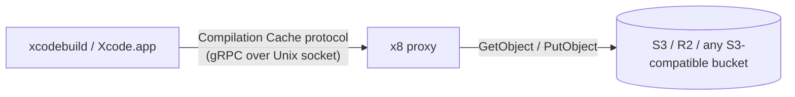

# 🗄️ x8

**An S3-compatible remote compilation cache proxy for Xcode.**

[](LICENSE)
[](https://swift.org)
[](https://developer.apple.com/macos/)

**[Full API documentation →](https://ryu0118.github.io/x8/documentation/x8kit/)**

Xcode 26 ships a built-in Compilation Cache, but it only caches locally —
every machine still compiles from scratch. x8 gives Xcode a *remote*
compilation cache: it speaks Xcode's cache protocol over a local Unix domain
socket and stores the objects in AWS S3, Cloudflare R2, or any other
S3-compatible bucket, so a team or CI can share compiled Swift/Clang module
outputs instead of every machine recompiling them.

## How it works



Xcode's Compilation Cache plugin is told (via a handful of build settings) to
talk to a local socket instead of nothing. x8 listens on that socket, speaks
the same gRPC protocol Xcode's plugin expects, and translates each cache
lookup or upload into an S3 `GetObject`/`PutObject` call against your bucket.

## Enabling the remote cache

X8 targets **Xcode 27 or later** for compilation-cache integration; Xcode 26
is unsupported. The prefix-mapped batch-diagnostics crash is fixed in the
**Swift 6.4 release branch** ([Swift PR #90700](https://github.com/swiftlang/swift/pull/90700)).
Xcode 27 beta 1 passed our minimal crash reproducer, but full application
compatibility and cross-worktree cache reuse are not yet verified. See
[toolchain support and evidence](Sources/X8Kit/X8Kit.docc/PrefixMapping.md#toolchain-support-and-evidence).
This is a support policy, not a CLI version check. The Swift 6.1 package-tools
version describes building X8 itself, not the supported Xcode cache client.
For macro-heavy targets, Xcode 27's prefix mapping is not sufficient by
itself: generated macro plugin executables can differ between worktrees and
therefore change Swift compile keys. See the `PrefixMapping` article linked
above for the current evidence and measurement scope.

There are two ways to point Xcode at x8's socket, depending on how you build.
For command-line builds, `x8 xcodebuild` supplies the cache connection and
prefix-mapping settings without changing build paths. For Xcode.app builds,
configure the printed cache settings in the project or an `.xcconfig`.

### 1. `xcodebuild` / CI — `x8 xcodebuild`

Wraps a normal `xcodebuild` invocation with an embedded, invocation-scoped
proxy. No `.xcconfig` or `project.pbxproj` edits required:

```sh
x8 xcodebuild xcodebuild -workspace MyApp.xcworkspace -scheme MyApp build
```

The first `xcodebuild` selects X8's subcommand; the second selects the child
executable. The child can also be an absolute path ending in `xcodebuild`.
X8 preserves the caller's build arguments and chosen directories.

x8 appends the three `COMPILATION_CACHE_*` settings and six prefix-mapping
settings plus an empty `CLANG_MODULES_BUILD_SESSION_FILE` as `SETTING=VALUE`
overrides. This omits a validation optimization whose physical path leaks into
Swift cache keys; normal module validation remains. The wrapper maps its physical working
directory to the shared `/^workspace` logical prefix while preserving the
actual checkout and build paths. It does not inject or replace
`-derivedDataPath`, `-clonedSourcePackagesDirPath`, or build-output settings.
Pass `--no-prefix-mapping` (before the child `xcodebuild` argument) if your
project manages these portability settings itself.

### 2. Xcode.app's GUI — ten build settings

Xcode's GUI builds can't be wrapped, so they need the settings Xcode's
Compilation Cache plugin looks for, added directly to your target (or an
`.xcconfig`) as **user-defined build settings** (they aren't exposed in
Xcode's Build Settings UI, so add them by name):

| Build Setting | Value |
| --- | --- |
| `COMPILATION_CACHE_ENABLE_CACHING` | `YES` |
| `COMPILATION_CACHE_ENABLE_PLUGIN` | `YES` |
| `COMPILATION_CACHE_REMOTE_SERVICE_PATH` | the socket path a running `x8 serve` prints |
| `SWIFT_ENABLE_PREFIX_MAPPING` | `YES` |
| `SWIFT_ENABLE_PROJECT_PREFIX_MAPPING` | `YES` |
| `CLANG_ENABLE_PREFIX_MAPPING` | `YES` |
| `CLANG_ENABLE_PROJECT_PREFIX_MAPPING` | `YES` |
| `CLANG_MODULES_BUILD_SESSION_FILE` | empty |
| `SWIFT_OTHER_PREFIX_MAPPINGS` | `$(PROJECT_TEMP_DIR)=/^derived $(BUILT_PRODUCTS_DIR)=/^built $(OBJROOT)/../..=/^dd /path/to/workspace=/^workspace` |
| `CLANG_OTHER_PREFIX_MAPPINGS` | `$(PROJECT_TEMP_DIR)=/^derived $(BUILT_PRODUCTS_DIR)=/^built $(OBJROOT)/../..=/^dd /path/to/workspace=/^workspace` |

Start the long-lived proxy and print those exact values:

```sh
x8 serve --workspace-directory /path/to/workspace --print-cache-settings
```

```text
CLANG_ENABLE_PREFIX_MAPPING=YES
CLANG_ENABLE_PROJECT_PREFIX_MAPPING=YES
CLANG_MODULES_BUILD_SESSION_FILE=
CLANG_OTHER_PREFIX_MAPPINGS=$(PROJECT_TEMP_DIR)=/^derived $(BUILT_PRODUCTS_DIR)=/^built $(OBJROOT)/../..=/^dd /path/to/workspace=/^workspace
COMPILATION_CACHE_ENABLE_CACHING=YES
COMPILATION_CACHE_ENABLE_PLUGIN=YES
COMPILATION_CACHE_REMOTE_SERVICE_PATH=/Users/you/Library/Application Support/X8/<profile-id>/cache.sock
SWIFT_ENABLE_PREFIX_MAPPING=YES
SWIFT_ENABLE_PROJECT_PREFIX_MAPPING=YES
SWIFT_OTHER_PREFIX_MAPPINGS=$(PROJECT_TEMP_DIR)=/^derived $(BUILT_PRODUCTS_DIR)=/^built $(OBJROOT)/../..=/^dd /path/to/workspace=/^workspace
```

Keep `x8 serve` running (e.g. under a LaunchAgent) and build from Xcode.app
as usual. Use the same logical `/^workspace` replacement on every machine;
neither mode relocates build outputs.
See the `Launchd` article in the generated ``X8Kit``
documentation (`Sources/X8Kit/X8Kit.docc/Launchd.md`) for the LaunchAgent
template and the `launchctl` commands to start, stop, restart, and diagnose
the service — there is no `x8 stop`; launchd owns that lifecycle.

## Setup

1. Create `.x8.yml` at your project root:

   ```yaml
   version: 1
   bucket: my-team-cache
   # endpoint is optional for AWS S3 — omit it entirely and x8 uses AWS's
   # default endpoint. Set it only for an S3-compatible provider (R2, etc.):
   endpoint: https://<account-id>.r2.cloudflarestorage.com
   ```

2. Provide credentials. Every field in `.x8.yml` supports POSIX-style
   `$VAR`/`${VAR}` expansion against the process environment, so static
   credentials can be committed by reference:

   ```yaml
   accessKeyID: ${AWS_ACCESS_KEY_ID}
   secretAccessKey: ${AWS_SECRET_ACCESS_KEY}
   ```

   Without static credentials, x8 falls back to Soto's standard credential
   provider chain (environment, shared config file, SSO, `AssumeRole`,
   container/instance metadata) — nothing to configure. Never commit a
   *literal* secret value to `.x8.yml`; `$VAR` references are fine.

3. Confirm everything is wired up:

   ```sh
   x8 doctor
   ```

4. Build — see [Enabling the remote cache](#enabling-the-remote-cache) above.

## Configuration

| Key | Required | Description |
| --- | --- | --- |
| `version` | yes | Config schema version. Currently `1`. |
| `bucket` | yes | The S3 bucket name. |
| `region` | no | AWS region or provider-specific signing region. Defaults to `us-east-1`. |
| `endpoint` | no | Custom endpoint for an S3-compatible provider (e.g. R2). Omit for AWS S3. |
| `role` | no | `producer`, `consumer`, or `both`. Defaults to `both`. |
| `accessKeyID` | no | Static access key ID. Omit to use Soto's standard credential provider chain. |
| `secretAccessKey` | no | Static secret access key, paired with `accessKeyID`. Never commit a literal value — use `$VAR` expansion. |
| `sessionToken` | no | Optional session token for temporary/STS credentials, paired with `accessKeyID`/`secretAccessKey`. |

Every key in this table can be set in `.x8.yml` — including `role` and, via
`$VAR` expansion, credentials — since it's the file every machine reads. An
optional, git-ignored `.x8.local.yml` next to it overlays values for
whichever machine it lives on: use it when a value is genuinely
machine-specific rather than something every clone of the repo should share.

`role` gates reads and writes at the storage boundary: `producer` writes only,
`consumer` reads only, and `both` permits both operations. Producer reads return
cache misses without contacting storage; consumer writes are rejected before
reaching storage. The role does not change where the cache lives, so a producer
job and a consumer laptop reading the same `.x8.yml` still share the same cache.
A single shared `role: both` in `.x8.yml` is
often enough; split it into `.x8.local.yml` overlays only when specific
machines need to be restricted:

```yaml
# .x8.local.yml on a CI runner
role: producer
```

```yaml
# .x8.local.yml on a developer's laptop
role: consumer
```

## Commands

| Command | Purpose |
| --- | --- |
| `x8 [xcodebuild] <xcodebuild> [args...]` | Run `xcodebuild` through an embedded, invocation-scoped cache proxy. |
| `x8 serve` | Run a standalone proxy at a stable socket, for Xcode's GUI or a supervised long-lived process. |
| `x8 config validate` | Validate `.x8.yml` and its resolved values. |
| `x8 config show` | Print resolved, non-secret configuration. |
| `x8 doctor` | Check configuration, storage access, and the local proxy in one pass. |
| `x8 cache purge` | Plan or delete aged staging/Action Cache objects, or unreachable CAS objects. |

Run `x8 help <subcommand>` for full flag documentation. `cache purge`'s
`--older-than` and `--grace-period` accept a number followed by `ms`, `s`,
`m`, `h`, or `d` (for example `30m`, `2h`, or `7d`).

## Installation

Each [GitHub Release](https://github.com/Ryu0118/x8/releases) publishes a
darwin universal binary archive and a SwiftPM `.artifactbundle`.

### Nest ([mtj0928/nest](https://github.com/mtj0928/nest))

```sh
nest install Ryu0118/x8
```

### Mise ([jdx/mise](https://github.com/jdx/mise))

```sh
mise use -g github:Ryu0118/x8
```

## Using another storage implementation

The official `x8` executable supports S3-compatible storage only. To use another
storage implementation, such as one you write for GCS or Azure, build your own
executable with the **X8CLI** library. It provides the same command definitions,
argument handling, and execution behavior:

```swift
let cli = X8CLI(
    configuration: loadConfiguration,
    storage: { MyStorage(configuration: $0) },
    shutdown: { try await $0.shutdown() }
)
await cli.main()
```

Supply your own configuration loader and a storage type conforming to
`CASStore` and `ActionCacheStore`. No CLI-specific storage protocol is required.
The configuration loader is an `async throws` closure, so loading configuration
and opening storage share one async execution path.
Your executable owns its configuration format and authentication; `.x8.yml`
and its S3 schema remain specific to the official executable. Administrative
commands additionally require the corresponding X8Storage capabilities.

Start with the [custom CLI guide](https://ryu0118.github.io/x8/documentation/x8cli/creatingacustomcli/)
and the [complete example package](Examples/CustomStorageCLI). Use **X8Kit**
directly when you want to design a different interface or embed the cache server.

## API reference

Full API documentation is published at
[ryu0118.github.io/x8/documentation/x8kit](https://ryu0118.github.io/x8/documentation/x8kit/).

## License

x8 is available under the MIT License. See [LICENSE](LICENSE) for details.
