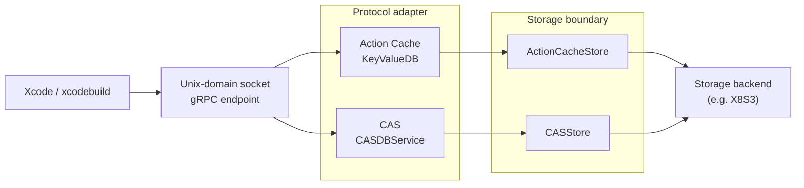

# Xcode cache runtime

Xcode talks to X8 through a gRPC endpoint on a Unix-domain socket. The socket
is an operating-system endpoint, not a cache key: CAS IDs and Action Cache
keys remain opaque protocol bytes inside the storage layer.

## Startup and readiness

Both runtime modes use the same server lifecycle:

1. A runner chooses a socket path and prepares its parent directory.
2. The runtime-directory value owns the filesystem context for that endpoint,
   including directory creation, socket permissions, and socket cleanup. The
   lifecycle coordinator asks the server factory for a configured server and
   starts its long-running `serve()` operation in a task.
3. The coordinator waits for the socket path to appear. A task that exits
   early, a missing endpoint after the startup deadline, or a filesystem
   failure is a startup failure; no partially ready session is returned.
4. Once the endpoint exists, the runtime-directory value applies restrictive
   socket permissions and the coordinator transfers ownership of the serving
   task to a session.
5. The caller retains the session or handle, uses the socket, and eventually
   requests graceful shutdown or waits for the server to stop naturally.

```mermaid
stateDiagram-v2
accTitle: Server Lifecycle States
accDescr: Startup moves from preparing the directory through serving and waiting for the socket to appear, then protecting it with restrictive permissions before reaching ready; any failure in that path moves to startup-failed and drains. From ready, shutdown or a transport failure moves to draining and then terminates.
    [*] --> PreparingDirectory: runner selects socket path
    PreparingDirectory --> Serving: server factory starts serve() task
    Serving --> WaitingForSocket
    WaitingForSocket --> WaitingForSocket: poll for the socket path
    WaitingForSocket --> ProtectingSocket: socket path exists
    WaitingForSocket --> StartupFailed: task exited early
    WaitingForSocket --> StartupFailed: startup deadline elapsed
    WaitingForSocket --> StartupFailed: cancelled or filesystem error
    ProtectingSocket --> Ready: restrictive permissions applied, task ownership to session
    ProtectingSocket --> StartupFailed: permission change fails
    StartupFailed --> Drained: graceful stop requested; serving task awaited
    Drained --> [*]: socket removed; original error rethrown
    Ready --> Draining: shutdown() or termination signal
    Ready --> Draining: transport failure (wait() rethrows after cleanup)
    Draining --> [*]: response files removed; socket removed
```

If startup fails, the coordinator requests a graceful stop, awaits the serving
task, removes the socket, and rethrows the original error. After readiness,
`wait()` propagates a transport failure after cleanup; `shutdown()` drains and
cleans up as a non-throwing cleanup operation. Response files created for
disk-backed CAS responses are removed when the server's serving loop ends.

## Runtime modes

`XcodeCacheSession` creates a private runtime directory and socket for one
external Xcode client. It starts the proxy, exposes the cache environment, and
removes the runtime directory when the caller shuts the session down. It never
launches or observes `xcodebuild`; the outer frontend owns that process
boundary.

`XcodeServeRunner` uses a caller-selected stable socket, refuses to unlink an
existing endpoint, and returns an `XcodeServeHandle` after readiness. The
handle keeps the standalone server session alive. A foreground command can
wait for `SIGINT` or `SIGTERM` through `waitForTerminationSignal()`, while a
supervisor can call `shutdown()` directly.

The stable socket path is only a client endpoint. Cache sharing and isolation
come from the storage configuration, such as the bucket and opaque Xcode
identifiers; changing the socket path does not rename cache records.

## Protocol and storage boundary

The protocol adapter translates `CASDBService` and `KeyValueDB` messages into
`X8Storage.CASStore` and `X8Storage.ActionCacheStore` operations. A missing record is a cache
miss; provider failures remain errors so a higher-level policy can fail open.
The server owns transport and temporary response files, while the supplied
storage implementations own cache records and their provider clients.
