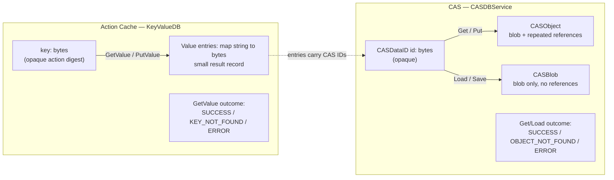
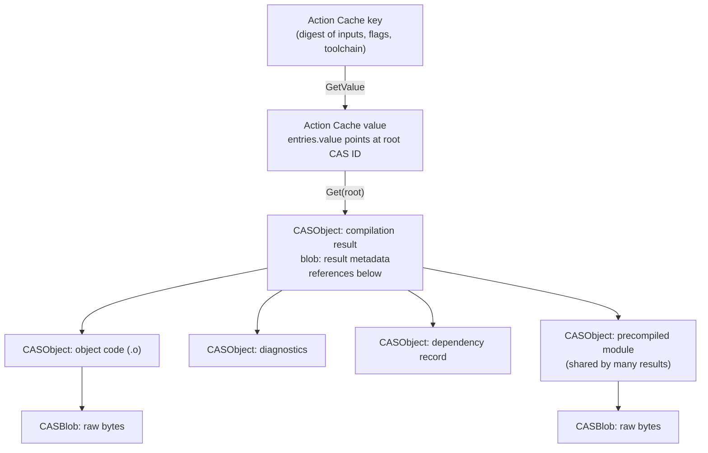
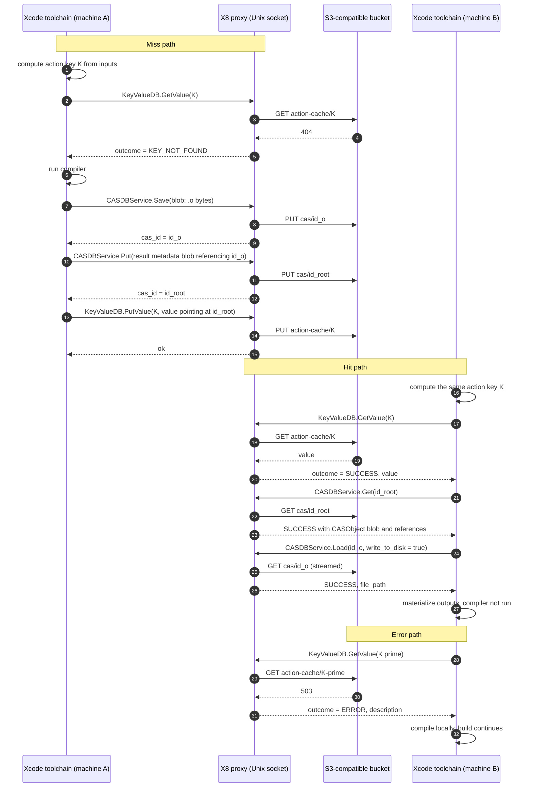
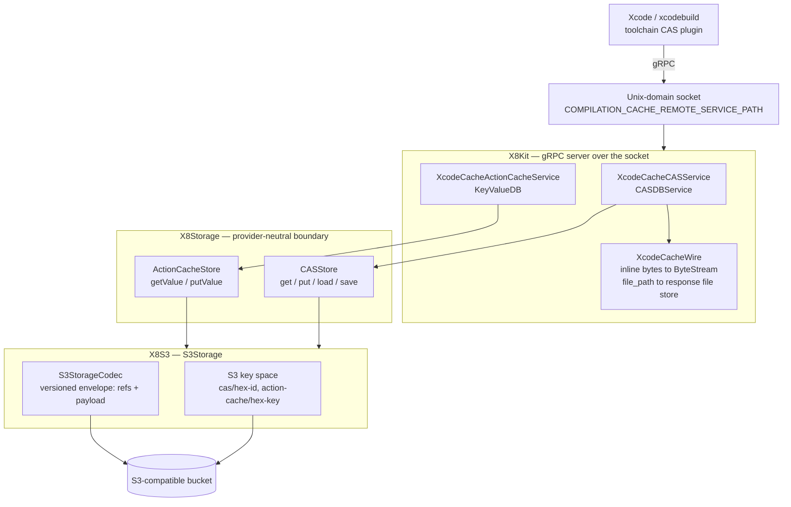
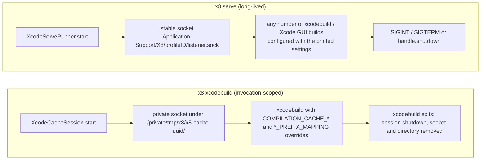

# Xcode compilation caching

How Xcode's remote compilation cache works on the wire, and where X8 sits in
that path.

## Overview

Xcode 26 introduced opt-in compilation caching. Apple's release notes describe
it as caching "the results of compilations that were produced for a set of
source file inputs" and replaying "the prior compilation results directly from
the cache" when the same inputs are compiled again, with the largest gains on
branch switches and clean builds. The feature is built on LLVM's
content-addressable storage (CAS) and its action cache; the local cache lives
in DerivedData.

A remote cache extends that local cache across machines: a CI fleet populates
it, developer machines and other agents read from it. Xcode does not talk to
object storage itself. It talks gRPC over a Unix-domain socket to a *remote
cache service*, and X8 is such a service: it implements the two gRPC services
Xcode expects and stores their records in an S3-compatible bucket.

The three build settings that wire this up are:

| Build setting | Effect |
| --- | --- |
| `COMPILATION_CACHE_ENABLE_CACHING=YES` | Turns on compilation caching. Apple's "Enable Compilation Caching" build setting. |
| `COMPILATION_CACHE_ENABLE_PLUGIN=YES` | Loads the toolchain's CAS plugin so cache lookups and stores go through the plugin instead of the local on-disk CAS only. |
| `COMPILATION_CACHE_REMOTE_SERVICE_PATH=<socket>` | The Unix-domain socket the plugin connects to. This is a filesystem path, not a host and port. |

X8's cache-settings contract emits these three values plus six
prefix-mapping settings: four enable flags and two mapping-value settings
and an empty `CLANG_MODULES_BUILD_SESSION_FILE`, described in
the [prefix-mapping guide](https://ryu0118.github.io/x8/documentation/x8cli/prefixmapping).
Xcode's build system resolves them as
build settings rather than inherited environment, so `x8 xcodebuild` appends
them as `SETTING=VALUE` command-line overrides; the standalone
`x8 serve --print-cache-settings` output is the same contract for a client
that configures itself.

## Two services, two kinds of record

The wire contract is two proto3 services checked in under
`Protos/compilation_cache_service/`. They map directly onto LLVM's two CAS
concepts:

- `CASDBService` is LLVM's `ObjectStore`: immutable, content-addressed
  objects. An object is a blob plus an ordered list of references to other
  objects, so objects form a DAG (per LLVM's CAS documentation).
- `KeyValueDB` is LLVM's `ActionCache`: a key-value store that maps "an input
  CASObject to an output CASObject with their CASIDs". The key identifies a
  compilation action; the value points at its cached outputs.

The two services are deliberately different shapes:

| | Action Cache (`KeyValueDB`) | CAS (`CASDBService`) |
| --- | --- | --- |
| Address | Opaque action key, chosen by the compiler | Opaque `CASDataID`, chosen by the CAS |
| Payload | Small map of string to bytes | Arbitrary bytes, optionally with references |
| Mutability | Replaceable per key (`PutValue` overwrites) | Immutable; same content, same ID |
| Miss | `KEY_NOT_FOUND` | `OBJECT_NOT_FOUND` |
| Failure | `ERROR` with `ResponseError.description` | `ERROR` with `ResponseError.description` |
| X8 boundary | `X8Storage.ActionCacheStore` | `X8Storage.CASStore` |

`Put`/`Get` carry a full `CASObject` (blob plus references). `Save`/`Load`
carry a bare `CASBlob` with no references; this is the raw-bytes path. Both
read RPCs accept `write_to_disk`, which asks the service to return a
`file_path` instead of inline `data` so large outputs never round-trip
through a gRPC message body. `CASBytes` is a `oneof` of `data` or
`file_path` in both directions, so a client can also hand the service a file
on `Put`/`Save`.

The miss-versus-error split is on the wire, not an X8 invention. A
`KEY_NOT_FOUND` or `OBJECT_NOT_FOUND` means "compile it"; an `ERROR` means the
service could not answer. X8 preserves that distinction end to end so a
storage outage degrades to a slower build rather than a failed one.

## CAS identifiers are opaque

`CASDataID.id` is bytes. LLVM's documentation states that an ID "created by
different ObjectStore[s] cannot be cross-referenced or compared", and the
plugin API hands the compiler whatever digest the plugin returns. X8 therefore
treats the ID as an opaque token: it is never re-hashed, never replaced by an
S3 ETag or key, and is mapped to a provider location only at the
storage-adapter boundary (`X8S3` uses a hex encoding of the same bytes under a
`cas/` prefix). The same holds for `KeyValueDB` keys.

## The object graph

A compiled output is not one blob. The compiler stores its result as a small
tree of CAS objects, and the action-cache value points at the root. Apple
does not document the node layout; the diagram shows the shape the protocol
permits.

Three properties follow from content addressing:

- Identical content has one ID. A precompiled module shared by two hundred
  translation units is stored once and referenced two hundred times.
- References are by ID, so a parent can only be written after its children
  exist. A client stores leaves first; X8 does not validate that referenced
  IDs are present, mirroring the protocol.
- The action-cache value is metadata, not the compiled bytes. `X8Core`'s
  `X8Core.ActionCacheValue` preserves the entries verbatim; the `value`
  entry contains serialized result metadata that refers to CAS IDs.

## A build, end to end

The sequence below is one compilation action on a cold cache, followed by the
same action on another machine. The client is the CAS plugin loaded by the
Xcode toolchain; which process holds the socket connection is not documented
and does not affect the protocol.

Notes on the diagram:

- The RPC names, outcomes, and `write_to_disk` behaviour are the checked-in
  protocol. The leaf-first store order follows from references being by ID.
- Step ordering within a real build is concurrent; many actions are in flight
  at once on one socket.
- The error path is what "fail open" means concretely: X8 answers `ERROR`,
  and the toolchain compiles as if no cache were configured.
- If DerivedData already holds an output, Xcode uses it and never asks the
  remote service.

## Where X8 sits

X8 is a protocol adapter. Each layer knows only the layer below it, and the
opaque identifiers pass through every layer unchanged.

Responsibilities per layer:

- **Server (X8Kit).** Owns the socket and the gRPC transport. Translates
  request bytes into a lazy `X8Storage.ByteStream` and response streams back into
  inline `data` (bounded) or a server-owned `file_path` when `write_to_disk`
  is set. Maps a `nil` from storage to `OBJECT_NOT_FOUND`/`KEY_NOT_FOUND` and
  a thrown error to `ERROR`. Records hit, miss, stored, and remote-error
  metrics. Has no idea what a bucket is.
- **Storage boundary (X8Storage).** `X8Storage.CASStore` and `X8Storage.ActionCacheStore`
  return `nil` for a miss and throw for a provider failure, so the split
  survives the layer change. Payloads cross as pull-driven `X8Storage.ByteStream`
  values; whole objects are not buffered by default. The bounded inline
  response limit and the disk-backed response file are the documented
  exceptions, and both live at this boundary.
- **Adapter (X8S3).** Maps opaque ID bytes to keys under fixed prefixes,
  wraps CAS objects in a versioned envelope that carries the reference list
  ahead of the payload, and stages CAS input locally so the body can be
  replayed to the provider. A `consumer`-role invocation wraps both stores so
  writes are rejected before any I/O and reads pass through unchanged.

## Two ways to expose the socket

Both entry points run the same server; they differ in who owns the socket and
for how long. <doc:XcodeCacheRuntime> describes the lifecycle mechanics.

| | `x8 xcodebuild` | `x8 serve` |
| --- | --- | --- |
| Socket | Throwaway, per invocation | Stable, per profile; existing path is refused, never unlinked |
| Settings | Injected by X8 as command-line overrides | Printed by `--print-cache-settings`; the client applies them |
| Typical client | CI job, scripted build | Xcode GUI, repeated local builds |
| Lifetime | Ends with the child process | Ends on signal, `shutdown()`, or transport failure |

The socket path is only an endpoint. Cache sharing and isolation come from
the bucket and the opaque Xcode identifiers; two proxies on different
sockets pointed at the same bucket share one cache.
